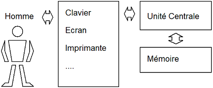
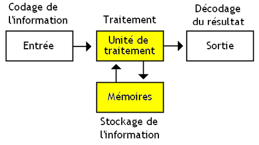

## Définition

Un code est un système de représentation d'informations permettant une interprétation sans ambiguïté de la dite information.

Exemple : Les panneaux de signalisation routière
  

Ce code est dit iconographique car il fait appel à des symboles graphiques pour représenter l'information.

Le `langage` employé a un certain vocabulaire : 

L'inconvénient majeur de ce type de représentation est qu'il nécessite un nouveau symbole pour chaque nouvelle information à représenter.

## Codifications informatiques

Si l'on rappelle le schéma fonctionnel de l'ordinateur

On doit établir un certain nombre de communications entre l'utilisateur et le cœur du système informatique.

L'ensemble de ces communications est basé sur un échange de caractères alphanumériques.

Concernant les traitements informatiques de l'information, nous distinguerons les notions de codification et de codage (bien que ces 2 termes soient souvent indifféremment utilisés).

### Codage

Représentation des informations dans un code donné.

### Codification

Consiste à affecter une référence (un code) à un ensemble d'objets traités par un ordinateur.

Exemples:  
- Un produit est représenté par un numéro
- Un stagiaire est représenté par un code 
- Un individu est codifié par son numéro de sécurité sociale

--- 

Ce document est essentiellement consacré au codage (représentation) des informations au sein de l'ordinateur; cependant avant d'aborder cette notion, nous consacrons un court paragraphe à la codification.

La codification devra être étudiée au mieux pour assurer une identification unique et sans ambiguïté de l'information; dans la mesure du possible elle permet des gains de place mémoire et de temps et offre des possibilités de contrôle de validité. 

On distingue plusieurs types de codes:

#### Le code séquentiel 
Le plus simple, il associe à chaque information un code défini de façon consécutive. Par exemple, les numéros de client numérotés de 1 à N, N étant le dernier client enregistré, le prochain enregistré aura le numéro N + 1.

#### Le code séquentiel par tranches
Un élément supplémentaire d'information est inclus dans le code. Par exemple dans une bibliothèque les références 1 à 9999 concernent l'Electricité, les références de 10000 à 19999, l'Automatisme, les références 20000 à 29999, la Thermodynamique...

#### Le code significatif
Constitué d'une association de chiffres ou/et de lettres permettant la désignation d'une information complexe. Le meilleur exemple est le numéro de sécurité sociale français constitué de plusieurs tranches ou champs ayant chacun une signification précise. On n'a plus la notion de références consécutives.

#### Le code contrôlable
Identique en principe aux précédents il ne fait que rajouter une clé de contrôle déterminée en fonction des carctères constituant le code et utilisée pour vérifier la présence ou plutôt l'absence d'erreur.

## Les systèmes de numération

Lorsqu'il s'agit de dénombrer un ensemble d'éléments, plusieurs solutions peuvent être utilisées. On peut par exemple tracer N tirets verticaux alignés côte à côte pour numéroter les N objets à compter; si l'on a 10 objets à compter, c'est acceptable mais si vous désirez compter le nombre de français âgés de 10 à 20 ans, cela devient inextricable et si l'on veut faire un calcul simple sur ces "nombres", ou plutôt ces tas de tirets cela devient impossible.

Historiquement, des notations plus condensées sont rapidement apparues. On peut citer la notation romaine où les seuls symboles de notations sont: I, V, X, L, C, D, M ce qui donne des nombres relativement compacts mais si l'on veut ajouter MCMLXXXVII à XCIX le problème n'est guère facile à résoudre.
Le système le plus connu et couramment utilisé est le système décimal qui nous vient de la culture Arabe. C'est un système de numérotation simple et très commode pour les calculs arithmétiques.

Rappelons la structure d'un nombre décimal:

> 125  =  1x100 + 2x10 + 5x1  =  1x102 + 2x101 + 5x100

- Les éléments du nombre `1`, `2` et `5` sont les coefficients
- `10` est la base du système de numération
- 2, 1 et 0, correspondant à la position de chaque élément, représente le poids de chaque chiffre

D'une façon générale, dans un système de numération n un nombre d'éléments N est représenté par la formule :

N=apnp+ap-1np-1+…+a1n+a0

où : 
a0 = nombre d'objets, inférieur à n n'ayant pu être classés dans un paquet de n éléments,
a1 = nombre de paquets (<n) de n objets, qui n’ont pu être classés dans un paquet de n2 objets, etc…

n est appelé la base du système de numération. 

On remarque qu'il faut n-1 symboles (de 1 à n-1) pour représenter les coefficients ap . On leur adjoint un nième symbole noté 0 (zéro) dont le rôle est fondamental : s'il n'y a pas de groupe n éléments, on remplacera le terme ai par 0. 

Dans un but de simplification, on convient de transcrire le nombre N sous la forme :

N = ap ap-1... a2 ai ao

La position i occupée par le symbole est appelé le poids attaché à ce symbole. 

 
Dans le système décimal, la base est prise égale à 10 (sûrement due à la similitude des 10 doigts de la main ?), les différents coefficients représentent pour a0 le chiffre des unités (poids 1), pour a1 celui des dizaines (10 unités, poids 10), a2 celui des centaines (poids 100), etc.

Remarquons qu'en base 10 il y a 10 symboles unitaires différents: 1, 2, 3,..., 8, 9 et 0 conformément à la règle énoncée ci-dessus qui stipule que pour une base n il faut n symboles différents (y compris le 0).

Muni de tous ces éléments il devient facile d’établir les notations dans un sytème de numération à base quelonque.
Dans tous les cas lorsque la base n'est pas implicite ou évidente, on note la valeur de cette base en indice après le nombre.

Exemples :

•	101001002 en système binaire (base 2)
•	1284210 en système décimal (base 10)
•	1284212 en système duodécimal (base 12)

Remarques :

Deux nombres peuvent s'écrire sous la même forme dans deux bases différents, MAIS ils n'auront pas la même valeur!

On veillera à ne pas confondre les termes numération et numérotation, ce dernier désignant l'opération consistant à numéroter, attribuer un nombre à un objet et non à définir le nombre lui-même.
 
Le système binaire

C’est le système à base 2 qui se prête à une utilisation par les machines et à fortiori par les calculateurs électroniques où tout fonctionne sur le principe de deux états d'équilibre stables. Les symboles utilisés pour représenter ces 2 états sont le 0 et le 1 ce qui permet d'établir la correspondance décimal-binaire suivante:

Décimal	Binaire
1	1
2	10
3	11
4	100
5	101
6	110
7	111
8	1000
9	1001
10	1010

Ici les poids sont respectivement de droite vers la gauche: 0, 1, 2, 3, 4, 5, 6, 7...

On désigne les poids de droite par les poids faibles (LSB en anglais pour Lost Significant Bit) alors que ceux de gauche sont dits poids forts. (MSB pour Most Significant Bit).

Exemple: 

Traduire en décimal le nombre binaire N = 100101

Prenons le nombre et indiquons les poids :

1	0	0	1	0	1	nombre
5	4	3	2	1	0	 poids
Ce qui donne:

N = 25 + 22 + 20, les autres coefficients étant nuls. Soit N = 32 + 4 + 1 = 3710 

D'où le résultat : 1001012 = 3710

Les règles de calcul arithmétiques binaires sont les suivantes :

Addition		Multiplication

0  +  0	= 0	0 x  0	0
0  +  1	= 1	0 x  1	0
1  +  0	= 1	1 x  0	0
1  +  1	= 10	1 x  1	1
