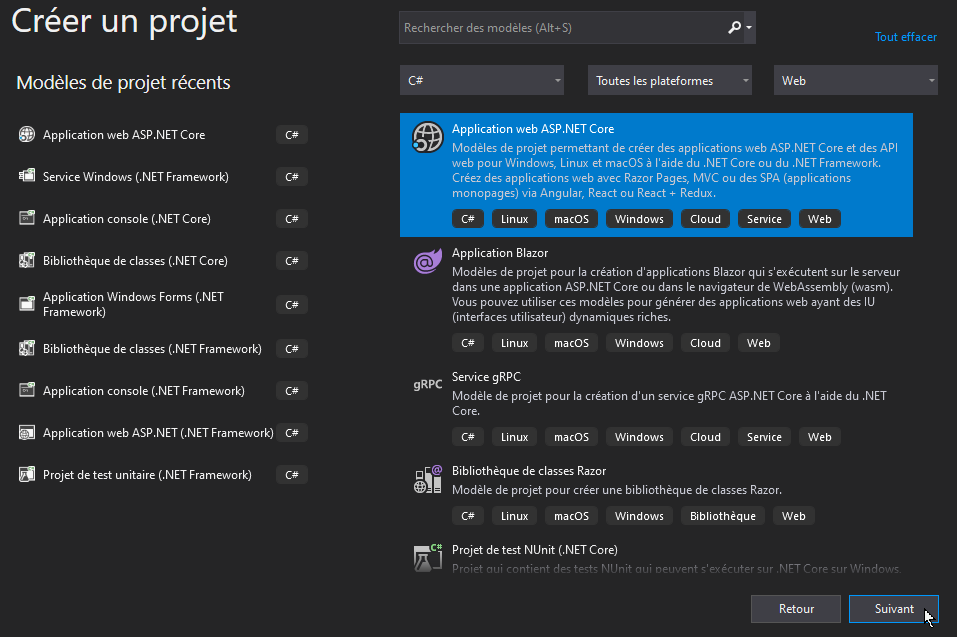
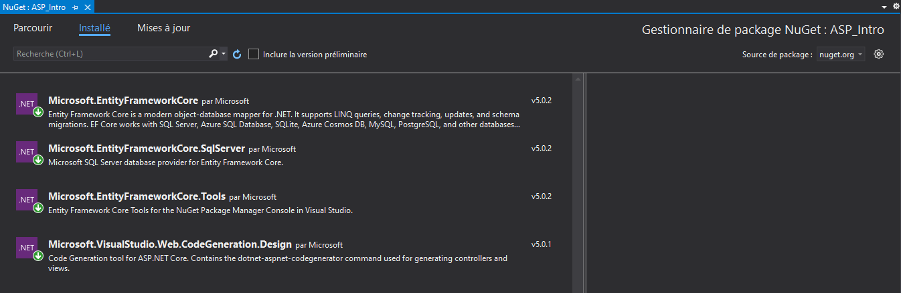
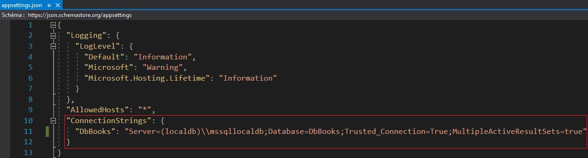

Créer un nouveau projet web MVC avec ASP.NET 5.x.

Ce document présente la procédure pour créer un nouveau projet ASP.NET MVC et y installer l'ORM EntityFramework.

## ASP.NET MVC

ASP.NET MVC est un framework Microsoft pour développer rapidement des applications web MVC avec la puissance du langage C#.

MVC signifie Model-View-Controller. Il s'agit d'un modèle architectural utilisé dans le développement de logiciels qui permet de séparer en 3 couches distinctes : 
- la couche Métier (Model)
- l'interface utilisateur (View)
- la logique de l'application (Controller)

Dans ASP.NET MVC, il existe des tas de concepts tels que TempData, RouteCollection, ViewData, Linq to SQL, Controller Action, Lambda Expression, Custom Route et HTML Helpers, qui lient tous le modèle, la vue et le contrôleur. Ceci peut rebuter les débutants, mais une fois pris en main, ASP.NET MVC est aussi accessible que tout framework MVC.

## Convention VS Configuration

Dans ASP.NET MVC, on parle plus de `convention` que de `configuration`. 

Vous aurez peu de configuration à faire dans un projet ASP.NET MVC tout étant plus ou moins prêt à l'emploi.

Par contre, Microsoft a mis en place des conventions de codage qui vous permettront, de gagner beaucoup de temps de développement si vous les suivez à la lettre. L'architecture étant déjà définie, vous pouvez vous concentrer sur le codage de la logique métier.

## Créer un projet web ASP.NET

- Ouvrir Visual Studio Community
- Créer un nouveau projet/solution
- Sélectionner le modèle "Application web ASP.NET Core"

- Sur l'écran suivant, nommer le projet/solution puis cliquer sur "Créer".

- Sur l'écran suivant, vous pouvez sélectionner le modèle vide ou le modèle MVC.
    - [Créer un projet ASP.NET à partir d'un modèle vide](asp-creer-projet-vide.html)
        - Vous devrez alors définir manuellement les composants que vous souhaitez utiliser.
    - [Créer un projet ASP.NET à partir d'un modèle MVC](asp-creer-projet-mvc.html)
        - L'architecture et les composants MVC de bases sont prêt à l'emploi.

## Ajouter Entity Framework Core

- Lorsque le projet est créé, ouvrir le gestionnaire de package NuGet
    - Explorateur de solution --> clic droit sur le nom du projet
    - Cliquer sur "Gérer les packages NuGet"

Installer les packages suivants : 
- Microsoft.EntityFrameworkCore.Design (nécessaire pour le package Microsoft.EntityFrameworkCore.Tools)
- Microsoft.EntityFrameworkCore.Tools ([plus d'infos](https://www.nuget.org/packages/Microsoft.EntityFrameworkCore.Tools))
- Microsoft.EntityFrameworkCore.SqlServer (ajoute le pilote permettant l'accès à SQLServer)

## Ajouter la chaine de connexion

- Ouvrir le fichier `appsettings.json` à la racine de votre projet 
- Ajouter une entrée `ConnectionStrings` qui contiendra la ou les chaines de connexion à une ou plusieurs bases de données.

Exemple : 

- Server = Nom d'hôte du serveur de bases de données (ou nom de l'instance SQLServer si sur la même machine)
    - (localdb)\mssqllocaldb = instance SqlServer locale installée avec Visual Studio.
- Database = Nom de la base de données sur le serveur
- Trusted_Connections = connexion sécurisée requise
- MultipleActiveResultSets (MARS) = permettre l'exécution de "lots d'instructions SQL"

## Développer la couche d'accès aux données

Une fois votre projet créé et Entity Framework installé, vous pouvez passer au développement de la couche d'accès aux données.

- [Entity Framework : Approche "Code First"](https://www.entityframeworktutorial.net/efcore/entity-framework-core-console-application.aspx)
- [Entity Framework : Approche "Database First"](asp-database-first.html)